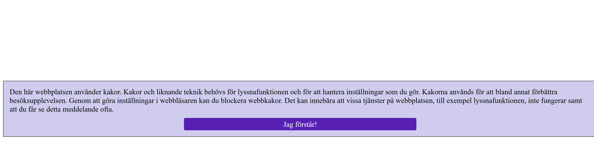
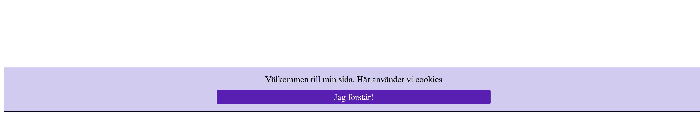

# pureCookie

Ett plugin för att hantera cookie popups med egen text

## Användning

### Standard config

- Skapa en div längst upp i body med id:et pure-cookie
- Länka till pure-cookie.css filen i head
- Länka till pure-cookie.js filen längst ner i body

```html
<!DOCTYPE html>
<html lang="sv-SE">
  <head>
    <meta charset="UTF-8" />
    <meta name="viewport" content="width=device-width, initial-scale=1.0" />
    <link rel="stylesheet" href="pure-cookie.css" />
    <title>pureCookie</title>
  </head>
  <body>
    <div id="pure-cookie"></div>

    ...
    <script src="path/to/pure-cookie.js"></script>
  </body>
</html>
```



### Custom config

Skapa en div längst upp i body med id:et pure-cookie och skriv din egna popup text inuti diven

```html
<!DOCTYPE html>
<html lang="sv-SE">
  <head>
    <meta charset="UTF-8" />
    <meta name="viewport" content="width=device-width, initial-scale=1.0" />
    <link rel="stylesheet" href="pure-cookie.css" />
    <title>pureCookie</title>
  </head>
  <body>
    <div id="pure-cookie">Välkommen till min sida. Här använder vi cookies</div>

    ...
  </body>
</html>
```


